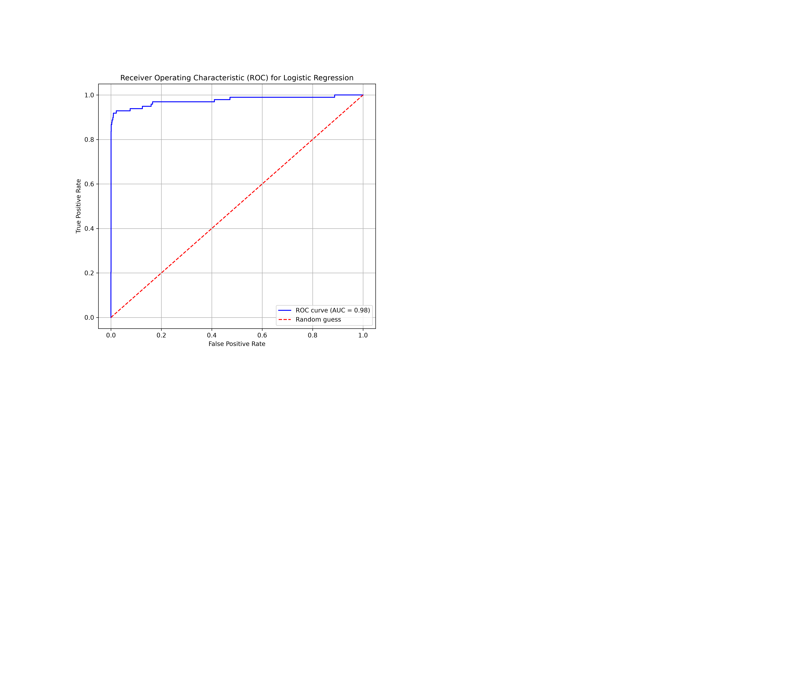
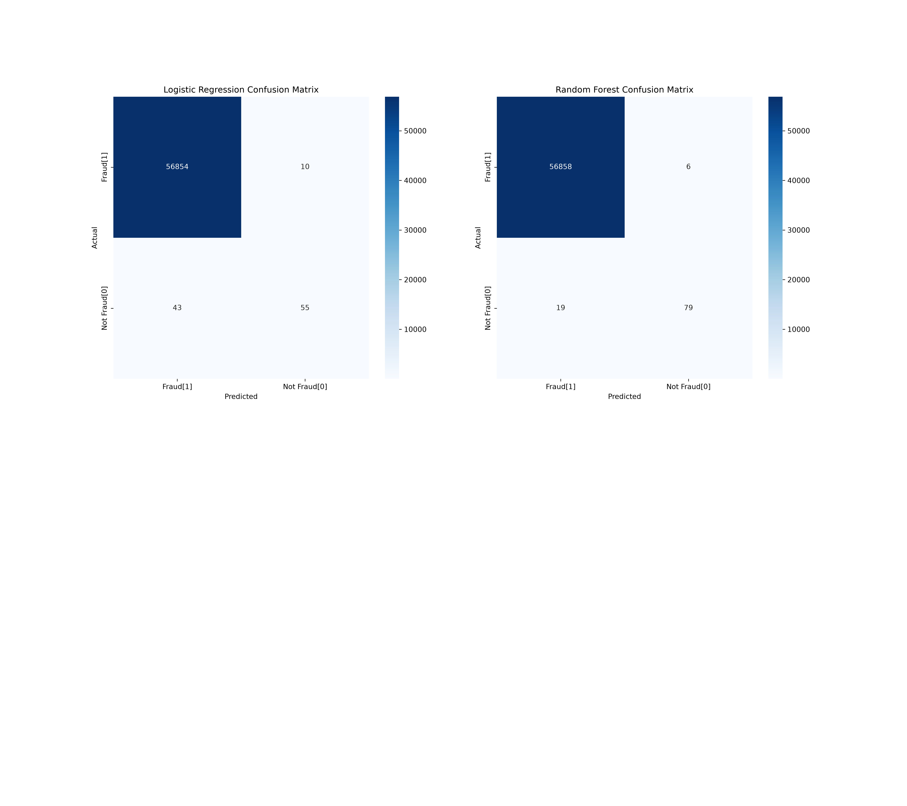
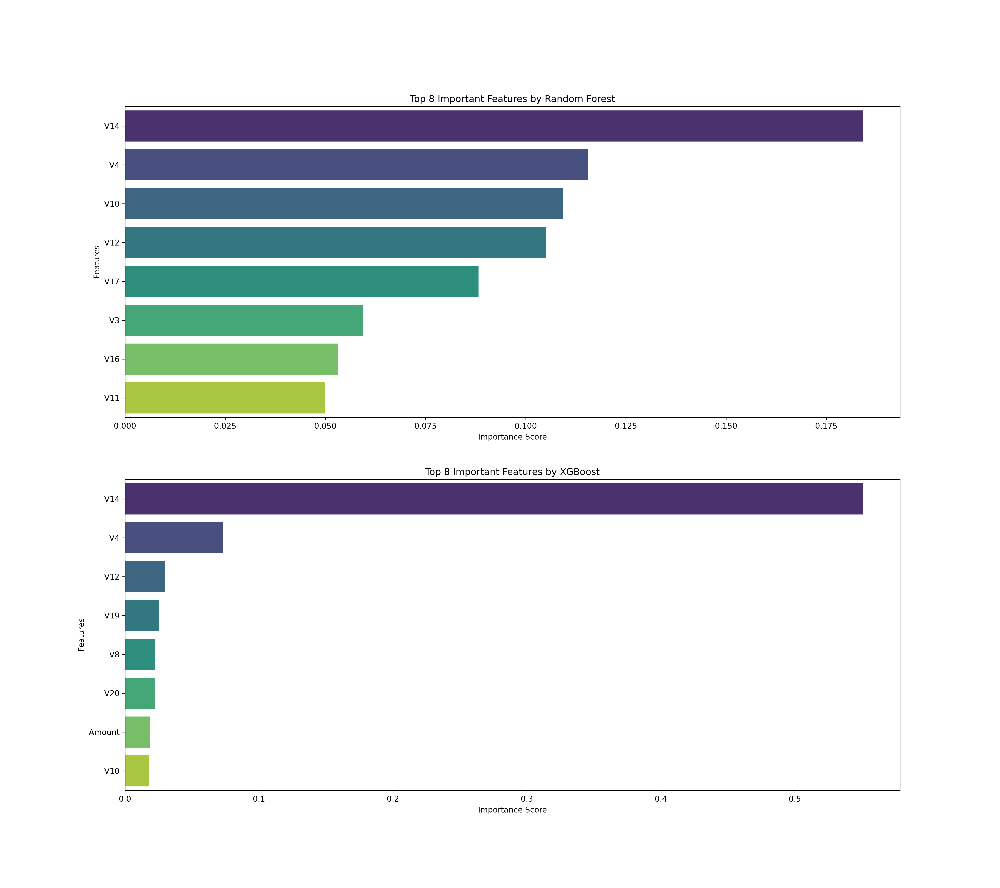

# 🛡️ Credit Card Fraud Detection


This project applies **machine learning models** to detect fraudulent credit card transactions using the Kaggle dataset.  
It demonstrates end‑to‑end workflow: preprocessing, oversampling, training, evaluation, visualization, and performance tracking.

---

## 📂 Project Structure

| Symbol | File/Folder              | Description |
|--------|---------------------------|-------------|
| 📂     | [src/](src)              | Source code for preprocessing and training |
| 📄     | [src/preprocess.py](src/preprocess.py)      | Data cleaning, SMOTE oversampling, exploratory plots |
| 📄     | [src/train_test_model.py](src/train_test_model.py) | Model training, evaluation, metrics logging, trend plots |
| 📂     | [results/](results)      | Saved models (.pkl) and scaler |
| 📂     | [plots/](plots)          | ROC curves, PR curves, confusion matrices, feature importance, distributions |
| 📄     | [creditcard.csv](creditcard.csv) | Kaggle dataset (Credit Card Fraud Detection) |
| 📄     | [requirements.txt](requirements.txt) | Python dependencies |
| 📄     | [results.csv](results.csv) | Model comparison results |
| 📄     | [LICENSE](LICENSE)       | MIT License |
| 📄     | [README.md](README.md)   | Project documentation |


## ⚙️ Features

### 🔹 Preprocessing
- 🧹 Drop NaN values in target column (`Class`)
- 🔢 Convert `Class` to integer
- 📏 Scale features with `StandardScaler`
- ⚖️ Handle imbalance with **SMOTE**
- 💾 Save cleaned dataset (`cleaned_resampled.csv`)
- 📊 Generate exploratory plots:
  - 📉 Class distribution (bar + pie)
  - 💵 Transaction amount distribution (histogram + boxplot)
  - ⏰ Fraud vs Non‑Fraud transaction time distribution
  - 🔥 Correlation heatmap

### 🤖 Models
- 📈 **Logistic Regression**
- 🌲 **Random Forest** (with feature importance)
- 🚀 **XGBoost** (with `scale_pos_weight`)
- 🎯 **RandomizedSearchCV** with StratifiedKFold for hyperparameter tuning

### 📊 Evaluation
- 📏 Metrics: Accuracy, Precision, Recall, F1, AUC
- 🌀 ROC curves and Precision‑Recall curves
- 🟦 Confusion matrices (heatmaps)
- 🌟 Feature importance plots
- 📈 Trend plots over time (Accuracy, F1, Precision, Recall, AUC)


## 🚀 How to Run
1. Clone the repository:
   ```bash
   git clone https://github.com/Akshay-1616/Credit_Card_Fraud_Detection.git
   cd Credit_Card_Fraud_Detection
Install dependencies:

bash
pip install -r requirements.txt
Run preprocessing:

bash
python src/preprocess.py
Train and evaluate models:

bash
python src/train_test_model.py
## 📊 Sample Outputs

This section highlights key visualizations generated during preprocessing and model evaluation.

### Preprocessing & Data Exploration
- **Class Distribution**  
  Shows the imbalance between fraud and non‑fraud transactions.
- **Transaction Amount Distribution**  
  Histogram and boxplot reveal spending patterns and anomalies.
- **Correlation Heatmap**  
  Displays relationships among anonymized features.

### Model Evaluation
- **ROC Curve (Logistic Regression)**  
  Illustrates the trade‑off between true positive rate and false positive rate.
  

- **Confusion Matrix (Random Forest)**  
  Highlights correct vs incorrect classifications.
  

- **Feature Importance (XGBoost)**  
  Shows which features contribute most to fraud detection.
  

### Trends & Comparisons
- Accuracy, Precision, Recall, F1, and AUC trends over time help compare model stability.


📦 Dataset
The dataset used is the Kaggle Credit Card Fraud Detection dataset (kaggle.com in Bing).
It contains anonymized features (V1–V28), Time, Amount, and Class (fraud or not fraud).

🛠 Requirements
See requirements.txt for dependencies.

📌 Usage Example
Load a saved model and make predictions:

python
import joblib
import pandas as pd

# Load scaler and model
scaler = joblib.load("results/scaler.pkl")
model = joblib.load("results/Random_Forest.pkl")

# Load new transaction data
new_data = pd.DataFrame([[0.1, -1.2, 0.3, ...]], columns=[...])  # same feature order

# Scale features
new_data_scaled = scaler.transform(new_data)

# Predict fraud probability
prob = model.predict_proba(new_data_scaled)[:,1]
print("Fraud probability:", prob[0])


## 🔮 Future Improvements

- 🤖 Add deep learning models (e.g., LSTMs, Autoencoders)
- 🌐 Deploy as a REST API or web app
- ⚡ Integrate real‑time fraud detection pipeline
- 🔍 Experiment with anomaly detection methods
- 📈 Expand evaluation with additional metrics and visualizations
- ☁️ Explore cloud deployment for scalability

# 🚀 Credit Card Fraud Detection (FastAPI Deployment)

This project demonstrates a machine learning pipeline for detecting fraudulent credit card transactions, deployed using **FastAPI**.

---

## 📦 Installation

Clone the repository and install dependencies:

```bash
git clone https://github.com/Akshay-1616/Credit_Card_Fraud_Detection.git
cd Credit_Card_Fraud_Detection
pip install -r requirements.txt
⚡ Run FastAPI Server
Start the FastAPI app with Uvicorn:

bash
uvicorn src.app:app --reload
The API will be available at: http://127.0.0.1:8000

Interactive Swagger docs: http://127.0.0.1:8000/docs

🔹 API Endpoints
Health Check
http
GET /health
Returns a simple status message.

Predict Transaction
http
POST /predict
Sample JSON Input:

json
{
  "Time": 0,
  "V1": -1.3598071336738,
  "V2": -0.0727811733099,
  "V3": 2.5363467379693,
  "V4": 1.3781552242744,
  "V5": -0.338320769942,
  "V6": 0.4623877777623,
  "V7": 0.239598554061,
  "V8": 0.098697901261,
  "V9": 0.363786969611,
  "V10": 0.090794171978,
  "V11": -0.551599533260,
  "V12": -0.617800855762,
  "V13": -0.991389847729,
  "V14": -0.311169353699,
  "V15": 1.468176972094,
  "V16": -0.470400525259,
  "V17": 0.207971241930,
  "V18": 0.025790580198,
  "V19": 0.403992960255,
  "V20": 0.251412098239,
  "V21": -0.018306777944,
  "V22": 0.277837575558,
  "V23": -0.110473910188,
  "V24": 0.066928074914,
  "V25": 0.128539358273,
  "V26": -0.189114843888,
  "V27": -0.055781461446,
  "V28": -0.059751840592,
  "Amount": 149.62
}
Sample Response:

json
{
  "prediction": 0
}
Where 0 = legitimate transaction, 1 = fraudulent transaction.

🧪 Testing API Accuracy
Run the testing script to validate predictions against the dataset:

bash
python src/test_api_accuracy.py
Output Example:

Code
Tested 100 rows
Correct predictions: 97
Accuracy: 0.97
📊 Notes
The dataset (creditcard.csv) should be placed in the project root folder.

Large files (like datasets) are excluded from GitHub via .gitignore. Download the dataset from Kaggle (kaggle.com in Bing).


👨‍💻 Author
Developed by Akshay Kumar (github.com in Bing)  
Feel free to fork, contribute, or open issues to improve the project.

📜 License
This project is licensed under the MIT License — see the [Looks like the result wasn't safe to show. Let's switch things up and try something else!] file for details.

Code

---

✅ This version has:
- Badges at the top (Python version, license, status).
- Inline plots for highlights (ROC, confusion matrix, feature importance).
- Proper Kaggle dataset link.
- Clean code block formatting.
- License section.

